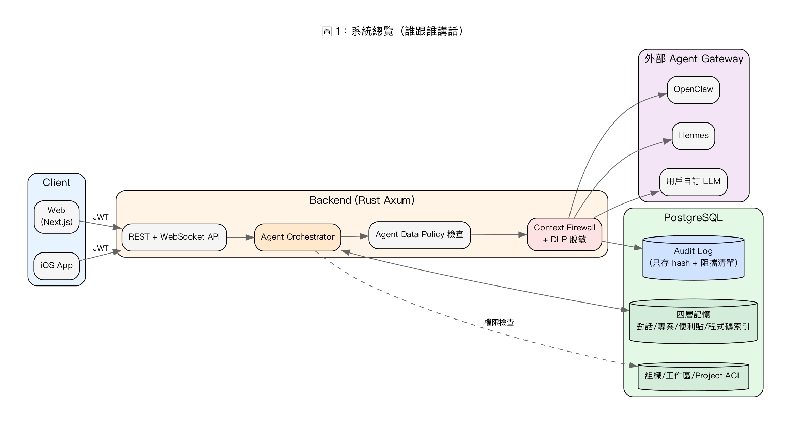
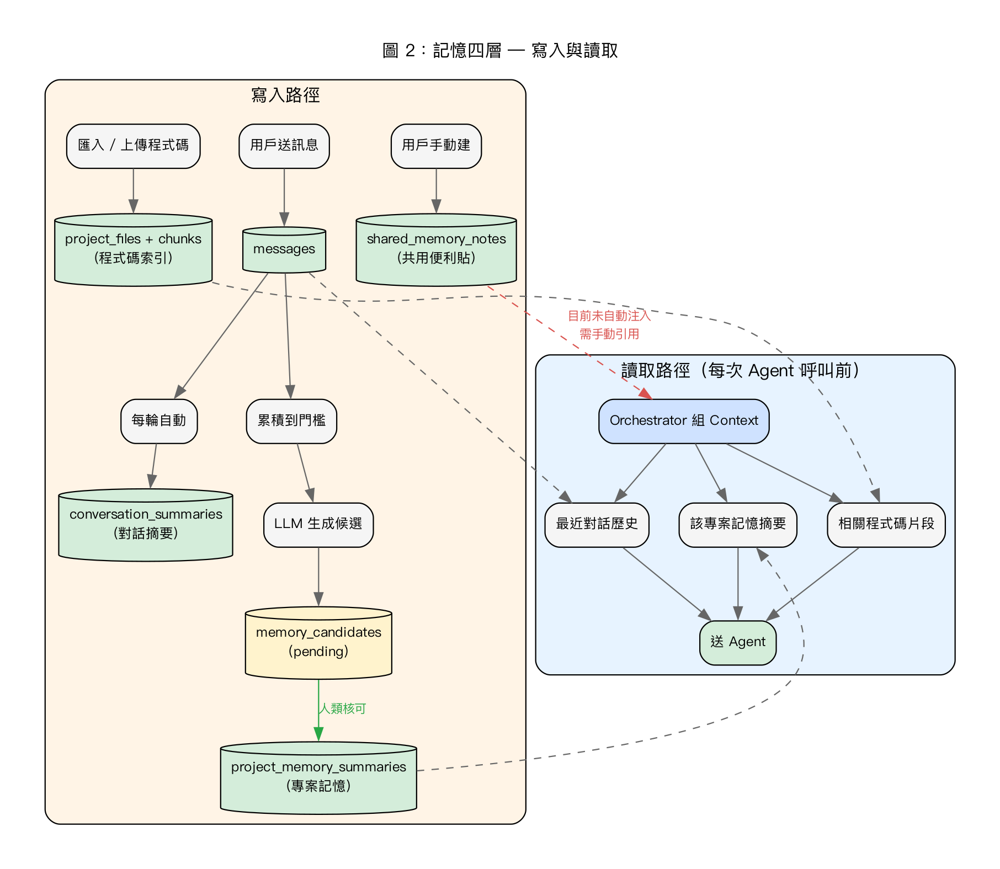
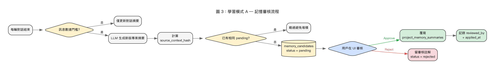
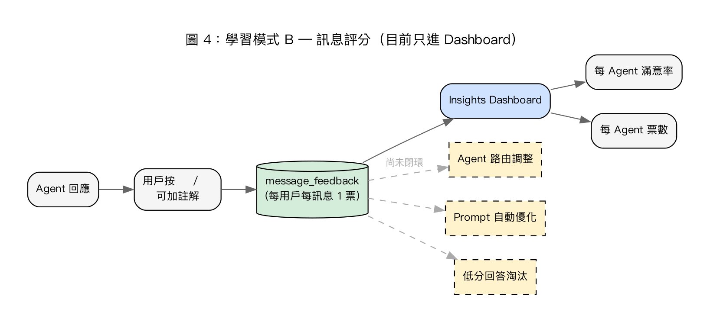
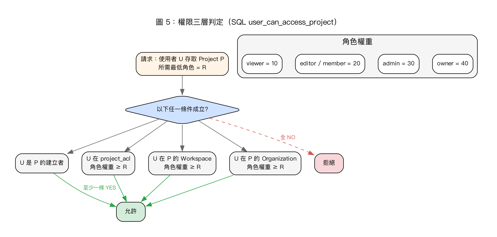
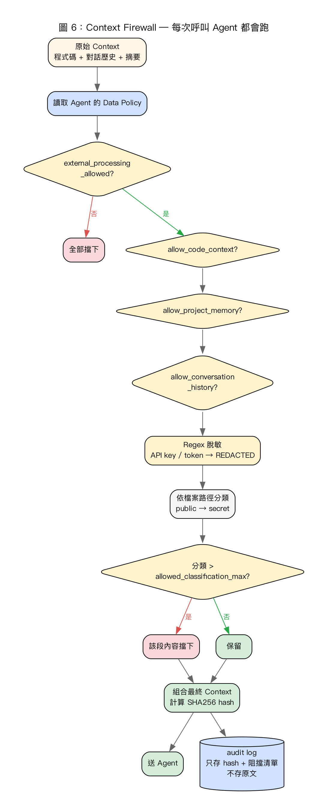
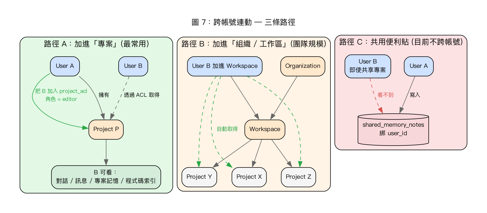
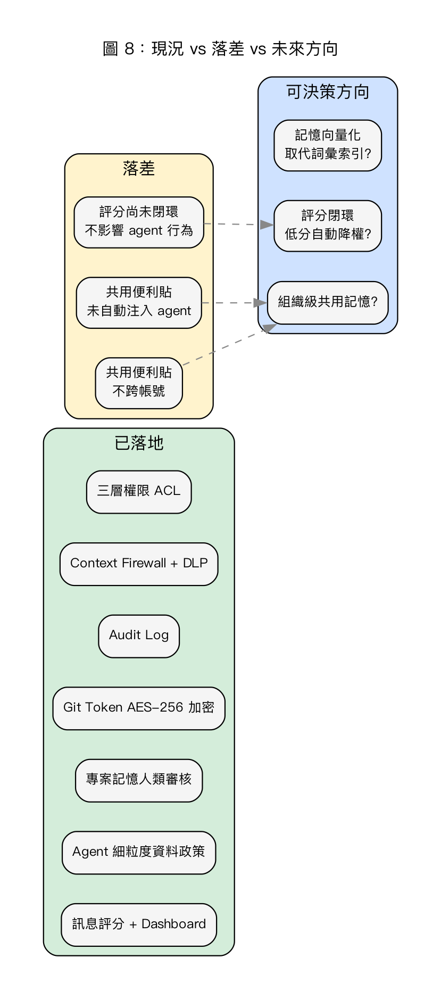

# Kway 平台 — 記憶 / 學習 / 權限 / 跨帳號連動 架構圖

> 會議簡報用 · 8 張流程圖（PNG 直接嵌入，任何 markdown 編輯器、Finder Quick Look 都能直接看）
>
> 圖檔位置：`assets/meeting-diagrams/`
> 重新產圖：`python3 scripts/render_meeting_diagrams.py`

---

## 系統一句話總覽

Kway 把「記憶」分四層存在 PostgreSQL，每次叫 agent（OpenClaw / Hermes / 自訂）回答前，後端會**主動組裝**對應記憶與權限，**經過資料防火牆**才送出。學習目前是「人類審核 + 評分」的半自動模式，沒有自動 retrain。跨帳號連動透過**組織／工作區／專案 ACL 三層**達成。

---

## 圖 1：系統總覽（誰跟誰講話）

**說明：** Client 經 JWT 進 Backend，Orchestrator 組好 context → 過 Data Policy → 過 Firewall（順便寫 audit log）→ 才送外部 Agent。所有資料庫存取都先過 ACL 檢查。

---

## 圖 2：記憶四層 — 寫入與讀取

**四層記憶：**
1. **對話摘要**（自動，每輪更新）
2. **專案記憶**（LLM 產生候選 → 人類核可才寫入）
3. **共用便利貼**（用戶手動建，⚠️ 目前 agent 不會自動拉）
4. **程式碼索引**（匯入時建立 chunks）

---

## 圖 3：學習模式 A — 記憶審核流程（核心防護）

**重點：** LLM 寫的摘要**永遠不會直接生效**，必須有人按 Approve。重複 hash 會被略過，避免候選堆積。

---

## 圖 4：學習模式 B — 訊息評分（目前只進 Dashboard）

**重點：** 評分目前只進報表（滿意率、票數），**未回饋給 agent 行為**（路由、prompt、淘汰皆未做）— 是會議可討論的「下一步」。

---

## 圖 5：權限三層判定（SQL 函式 `user_can_access_project`）

**重點：**
- 每一次資料讀取都跑這支 SQL
- **取最高權限**：建立者 / Project ACL / Workspace / Organization 任一條件成立即放行
- 角色權重：owner=40 > admin=30 > editor/member=20 > viewer=10

---

## 圖 6：Context Firewall — 每次呼叫 Agent 都會跑

**重點：**
- 四道閘：external → code → memory → history
- 一律過 regex 脫敏（API key / token → REDACTED）
- 依檔案路徑做分類，超過 agent 允許等級就**整段擋下**
- **辯論模式特例：** 多 agent 一起講話時取**最嚴**政策（AND 布林、MIN 分級）
- Audit log 只存 hash 與阻擋清單，**不存原文**

---

## 圖 7：跨帳號連動 — 三條路徑

**三條路徑：**
- **A. 專案 ACL**（點對點分享，最常用）
- **B. 組織 / 工作區**（團隊規模批量授權）
- **C. 共用便利貼**：⚠️ **目前是個人專用**，B 看不到 A 的便利貼 — 是會議可討論的設計選項

---

## 圖 8：現況 vs 落差 vs 未來方向（會議結論用）

**已落地（7 項）：** 三層權限 / Firewall / Audit / Token 加密 / 記憶審核 / Agent 資料政策 / 評分 Dashboard
**落差（3 項）：** 便利貼未自動注入 / 評分未閉環 / 便利貼不跨帳號
**未來方向（3 項）：** 記憶向量化 / 組織級共用記憶 / 評分閉環

---

## 重點對話檔（建議拿這幾條當會議話題）

| 話題 | 建議發言 |
|---|---|
| 已落地優勢 | 三層權限 + 資料防火牆 + 記憶審核 = 比直接接 ChatGPT 安全得多，且有 audit log |
| 已落地優勢 | 專案記憶要「人核可」才寫入 → AI 不會擅自改寫團隊共識 |
| 落差 1 | 共用便利貼（shared notes）寫好了 CRUD，但 **agent 還沒自動拉進 context**，目前要靠用戶在對話裡引用 |
| 落差 2 | 評分（👍👎）目前只進 dashboard，**沒回饋到 agent 行為**（沒做 reranking／淘汰／prompt 調整） |
| 落差 3 | 共用便利貼**不跨帳號** — 若要做「組織級共用記憶」需要新 schema |
| 可決策事項 | 要不要把記憶向量化（目前是詞彙索引）？要不要加「組織級共用記憶」？評分要不要閉環？ |

---

## 對應原始碼位置（會議追問用）

| 主題 | 檔案 |
|---|---|
| 對話摘要 | `backend/migrations/0020_conversation_summaries.sql` |
| 專案記憶 | `backend/migrations/0004_project_memory_summaries.sql` |
| 記憶審核 | `backend/migrations/0018_memory_approval_flow.sql` + `backend/src/api/conversation_memory.rs` |
| 共用便利貼 | `backend/migrations/0015_cross_project_b_set.sql` + `backend/src/api/shared_memory.rs` |
| 程式碼索引 | `backend/migrations/0006_project_file_index.sql` |
| 訊息評分 | `backend/migrations/0009_message_feedback.sql` + `backend/src/api/feedback.rs` |
| 評分報表 | `backend/src/api/metrics.rs` |
| 組織 / 權限 | `backend/migrations/0019_organization_project_acl.sql` + `backend/src/api/organizations.rs` |
| Agent 資料政策 | `backend/migrations/0017_agent_data_policy.sql` |
| Context Firewall | `backend/migrations/0016_context_firewall_dlp.sql` + `backend/src/security/context_firewall.rs` |
| 脫敏分類 | `backend/src/security/redaction.rs` |
| Git Token 加密 | `backend/migrations/0005_encrypt_git_tokens.sql` + `backend/src/crypto.rs` |
